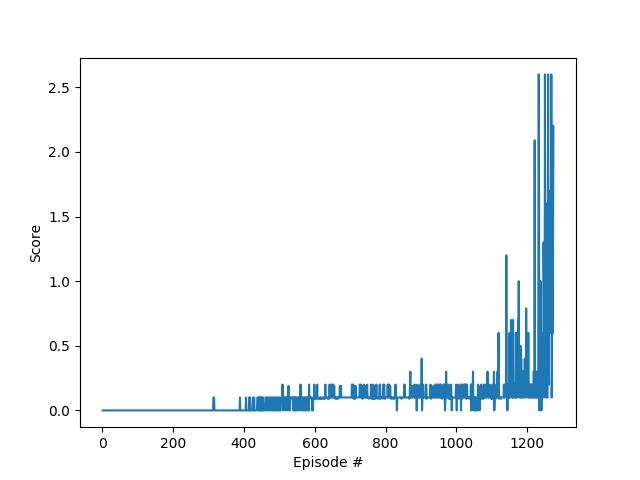
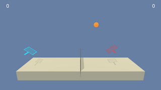

# Multi-Agent DDPG application for a tennis game

### Project Details

As a part of **Udacity Deep Reinforcement Learning Nanodegree** course, this is the third project in which the goal was to develop a competetive MultiAgentRL (MARL) algorithm to do a task on a continous state and continous action space. I have used **Deep Deterministic Policy Gradient** method to solve this problem. I have used a shared replay buffer and two agents share the experiences as their observations are local.

##### Problem Definition

Two agents control rackets to bounce a ball over a net. If an agent hits the ball over the net, it receives a reward of +0.1. If an agent lets a ball hit the ground or hits the ball out of bounds, it receives a reward of -0.01. Thus, the goal of each agent is to keep the ball in play.


##### Environment Details

In this environment, the observation space consists of 8 variables corresponding to the position and velocity of the ball and racket. Each agent receives its own, local observation. Two continuous actions are available, corresponding to movement toward (or away from) the net, and jumping.

```
Number of agents: 2
Size of each action: 2
There are 2 agents. Each observes a state with length: 24
The state for the first agent looks like: [ 0.          0.          0.          0.          0.          0.
  0.          0.          0.          0.          0.          0.
  0.          0.          0.          0.         -6.65278625 -1.5
 -0.          0.          6.83172083  6.         -0.          0.        ]
```
The task is episodic, and in order to solve the environment, the agents must get an average score of +0.5 (over 100 consecutive episodes, after taking the maximum over both agents).

### Solution Description

I have used DDPG to solve this task. Please see `Report.md` for complete details.

### Getting started

1. Make sure you have `python 3.6` installed.

2. Install other dependencies:
```
pip install -r requirements.txt
```
3. To test the pretrained agent, run
```
python Tennis.py
```
4. To train the agent, run
```
python Tennis.py -t
```

### Results
The below plot shows the scores during training 


The task is solved in 1273 episodes with average max score over 100 episodes of 0.51.



### Instructions

- *Tennis.py* is the main file which runs trains\test the agent.
- *maddpg.py* contains the definition of a Multi-Agent DDPG class which uses a shared Replay buffer for training both the agents.
- *ddpg_agent.py* contains the definition of DDPG agent class with all necessary methods like act, step, learn, etc. It also contains the definition of the Replay Buffer class for storing the experiences.
- *model.py* contains the definition of the Actor and Critic model which is implemented in **Pytorch** framework.
- *OUnoise.py* contains the definition of OUnoise with its parameters. The noise decay over iterations can be visualized by running `python OUnoise.py`
- *checkpoint_critic.pth* is the best model checkpoint of Critic if the goal is achieved within max number of episodes. If not, the latest model is saved.
- *checkpoint_actor.pth* is the best model checkpoint of Actor if the goal is achieved within max number of episodes. If not, the latest model is saved.
- *Tennis_Linux* folder contains the Unity ML-Agent files needed for the simulating the environment.
